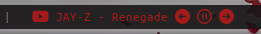
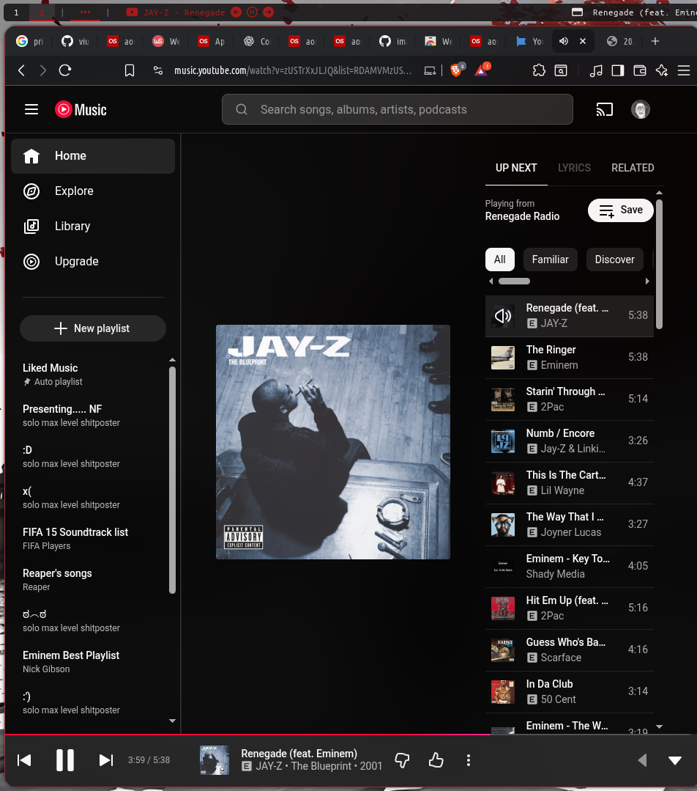
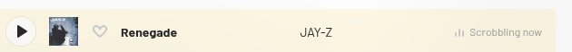

# ytmusic-polybar

display your **YouTube Music Web** playback status directly in **polybar**  
integrates seamlessly with **[web scrobbler](https://webscrobbler.com/)** for **last.fm scrobbling**, allowing your music history to be automatically tracked while you listen.



# features

-  displays the current **YouTube Music** track in real time
-  supports **last.fm scrobbling** via [web scrobbler](https://webscrobbler.com/)
-  works with brave, Chromium, and Firefox browsers

# dependencies

- playerctl
- [web scrobbler browser extension](https://webscrobbler.com/)
- [last.fm api key](https://www.last.fm/api/account/create)
- font-fonts-awesome

# suggested usage

copy the module configuration into your polybar `config`.  
place the `play_music.sh` script in `~/.config/polybar/ytmusic/` and make it executable.

```bash
chmod +x ~/.config/polybar/ytmusic/play_music.sh
```

# simple usage

add this section to your polybar configuration:

```
[module/music]
type = custom/script
exec = ~/.config/polybar/ytmusic/play_music.sh
interval = 0
#label-padding = 2
#label-foreground = ${colors.primary}
#click-left = xdg-open https://music.youtube.com/
```
# screenshots


