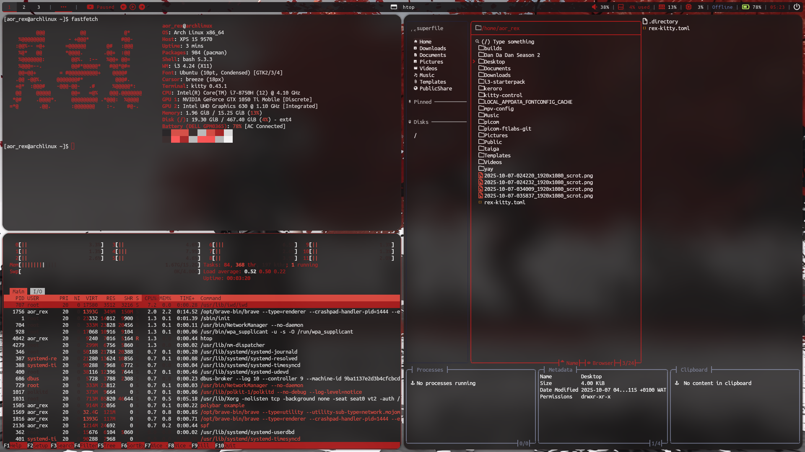

# i3-dotfiles
dotfiles for i3-wm using polybar and picom

## overview

- **base:** i3-wm (i3 with gap support)  
- **terminal:** kitty  
- **launcher:** rofi  
- **bar:** polybar (i3blocks and i3status also inluded)  
- **compositor:** picom (toggleable)  
- **wallpaper manager:** feh  

## ⚙️ keybinds
**$mod = windows key**
 ### 🪟 window management
| action | keybinding |
|--------|-------------|
| open terminal | `$mod + Enter` |
| kill focused window | `$mod + Shift + Q` |
| toggle floating | `$mod + Shift + Space` |
| fullscreen toggle | `$mod + F` |
| split vertical / horizontal | `$mod + V` / `$mod + H` |
| Focus parent container | `$mod + A` |
| resize mode | `$mod + R` |
| move window | `$mod + Shift + [J/K/L/;]` |
| focus window | `$mod + [J/K/L/;]` |
---

### 🖥️ workspaces
workspaces are numbered **1–10**.

| action | keybinding |
|--------|-------------|
| switch to workspace | `$mod + [1–0]` |
| move window to workspace | `$mod + Shift + [1–0]` |
---

### 🧩 gaps mode
manage i3-gaps dynamically.

| action | keybinding |
|--------|-------------|
| enter gap mode | `$mod + Shift + G` |
| adjust inner/outer gaps | `+ / - / 0` (local) or `Shift + + / - / 0` (global) |
---

## 🧾 miscellaneous

- Toggle picom: `$mod + P` 
- reload config: `$mod + Shift + C`
- restart i3: `$mod + Shift + R`
- exit i3: `$mod + Shift + E`
- screenshot: `$mod + Print`


---

## 🛠️ requirements

| dependency | description |
|-------------|-------------|
| `i3-wm` | window manager |
| `polybar` | status bar |
| `rofi` | app launcher |
| `kitty` | terminal |
| `picom-fitlabs-git` | Compositor |
| `feh` | Wallpaper tool |
| `brightnessctl` | brightness control |
| `pactl` | audio control |
| `nm-applet` | network tray |
| `dex` | Autostart |
| `scrot` | screenshot |
| `xrandr` | screen resolution |
| `superfile` | file manager |

## installing config files

``` bash
git clone https://github.com/aor-rex/i3-dotfiles.git
cd i3-dotfiles
```
### for arch distros
``` bash
chmod +x arch-install.sh
./arch-install.sh
```
### for debian distros
``` bash
chmod +x deb-install.sh
./deb-install.sh
```
## note
- check out [ytmusic-polybar](https://github.com/aor-rex/i3-dotfiles/tree/main/.config/polybar/ytmusic)

## 📸 Screenshot

